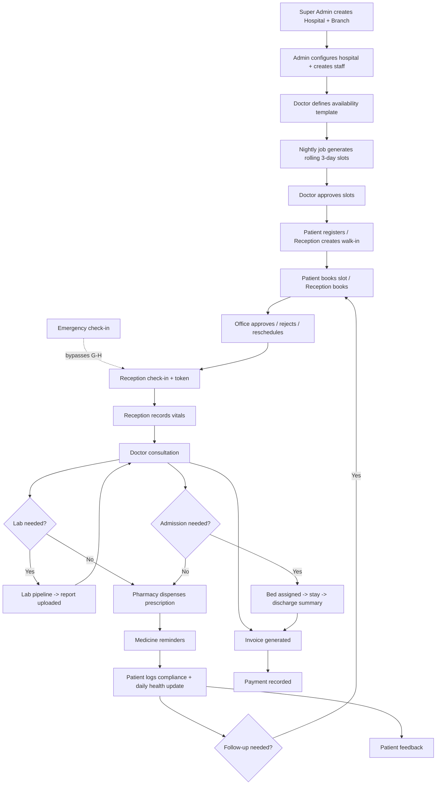

# 03 — Improved End-to-End Workflow

Supersedes the raw workflow in the original spec, incorporating the resolutions from
[01-requirement-analysis.md](./01-requirement-analysis.md) and additions from
[02-missing-features.md](./02-missing-features.md). All manual-approval gates from the
original spec are preserved — automation removes tedium, not oversight.

## 3.1 Platform & hospital setup

1. Super Admin creates a Hospital → a default "Main Branch" is created automatically
   → Super Admin adds further Branches if needed → assigns a Hospital Admin.
2. Admin configures the hospital: Departments, Rooms/Wards/Beds, Lab Test Master,
   Medicine Inventory catalog, Hospital Timings, Holiday calendar, Consultation Fees.
3. Admin creates branch-scoped staff accounts: Doctors, Office, Reception, Pharmacy,
   Laboratory — each pinned to one branch.

## 3.2 Doctor availability (automated slot generation)

4. Doctor (or Admin, delegated) defines a weekly recurring availability template:
   working days, hours, slot duration, breaks.
5. Nightly scheduled Cloud Function generates the next day's slots from all active
   templates + holiday calendar, maintaining a constant rolling 3-day visible window,
   status = `pendingApproval`.
6. Doctor reviews and approves generated slots (or Office manually blocks/adds
   one-off slots for exceptions). **Only approved slots are visible to patients.**

## 3.3 Patient onboarding

7. Patient self-registers via the web patient portal (name, age, gender, DOB, phone,
   email, address, blood group, emergency contact, medical history, current
   medications, allergies, insurance-optional) — **or** Reception creates a walk-in
   patient record directly for patients who don't self-register.

## 3.4 Booking

8. Patient books an approved slot via the portal, **or** Reception books on their
   behalf for a walk-in/phone booking.
9. Office reviews the request: Approve / Reject / Reschedule.
10. Patient receives an FCM appointment-confirmation notification.

## 3.5 Emergency path (bypasses 3.4 entirely)

- Reception/Office marks a patient as Emergency at any point → system creates an
  Emergency Queue entry with highest priority, independent of slot availability →
  Office and the relevant Doctor are notified immediately.

## 3.6 Arrival & check-in

11. Reception verifies the appointment (or emergency queue entry), generates a token.
12. Reception records vitals: weight, height, BMI (auto-calculated), blood pressure,
    pulse, sugar, temperature, SpO2, chief complaint, notes.
13. Vitals appear instantly on the Doctor's queue/patient view.

## 3.7 Consultation

14. Doctor reviews the patient's full history: past prescriptions, lab reports,
    allergies, medical history, current medications.
15. Doctor diagnoses, writes clinical notes, writes a prescription.
16. As needed, Doctor: orders Lab tests, recommends Radiology, recommends Admission
    (assigns a bed), schedules a Follow-up, issues a Medical Certificate, or Refers
    the patient to another doctor/department.
17. Every write in this step is captured by the audit-log service; nothing here is
    ever hard-deleted (§8 of missing-features).

## 3.8 Laboratory (if tests were ordered)

18. Lab order pipeline: `Pending` → `Sample Collected` → `Processing` → `Completed` →
    `Verified` → `Report Uploaded`.
19. Doctor and Patient both receive a notification when the report is uploaded.
20. Doctor reviews the report against the working diagnosis, may revise treatment.

## 3.9 Pharmacy

21. Pharmacy receives the prescription, dispenses medicine (records dosage,
    frequency, duration, instructions per item), updates inventory stock.
22. Dispensing automatically schedules medicine reminders for the patient.

## 3.10 Recovery tracking (patient-driven, doctor-monitored)

23. Patient marks each scheduled dose as Taken / Missed / Skipped.
24. Patient logs a daily health update: condition (Better/Same/Worse), pain level,
    sugar, BP, temperature, weight.
25. Doctor monitors compliance and recovery trend on the patient's timeline; schedules
    a Follow-up when warranted — loops back to §3.4 booking.

## 3.11 Admission path (if a bed was assigned in §3.7)

26. Bed status flips `Available` → `Occupied`; stay tracked in `admissions`.
27. On release, the attending Doctor must author and sign off a structured Discharge
    Summary (diagnosis, treatment given, condition at discharge, follow-up
    instructions) — enforced before the bed can flip back to `Available`.

## 3.12 Billing

28. Every billable event across §3.7–§3.11 (consultation fee, lab fees, pharmacy
    charges, room charges) rolls into an `invoices` record for the visit/admission.
    Reception/Admin record payments (cash/card/UPI, manual entry); invoice tracks
    unpaid/partial/paid status. No payment gateway in Phase 1.

## 3.13 Feedback

29. After a visit is marked complete, Patient may leave a rating (1–5) + comment.
    Marking it a complaint routes it to Admin's dashboard for resolution tracking.

## 3.14 Notifications (fire throughout, via FCM)

Appointment confirmation, appointment reminder, slot-approval (implicit — slots
becoming bookable), medicine reminder, lab report ready, prescription ready,
follow-up reminder, emergency updates.

## 3.15 Flow diagram

