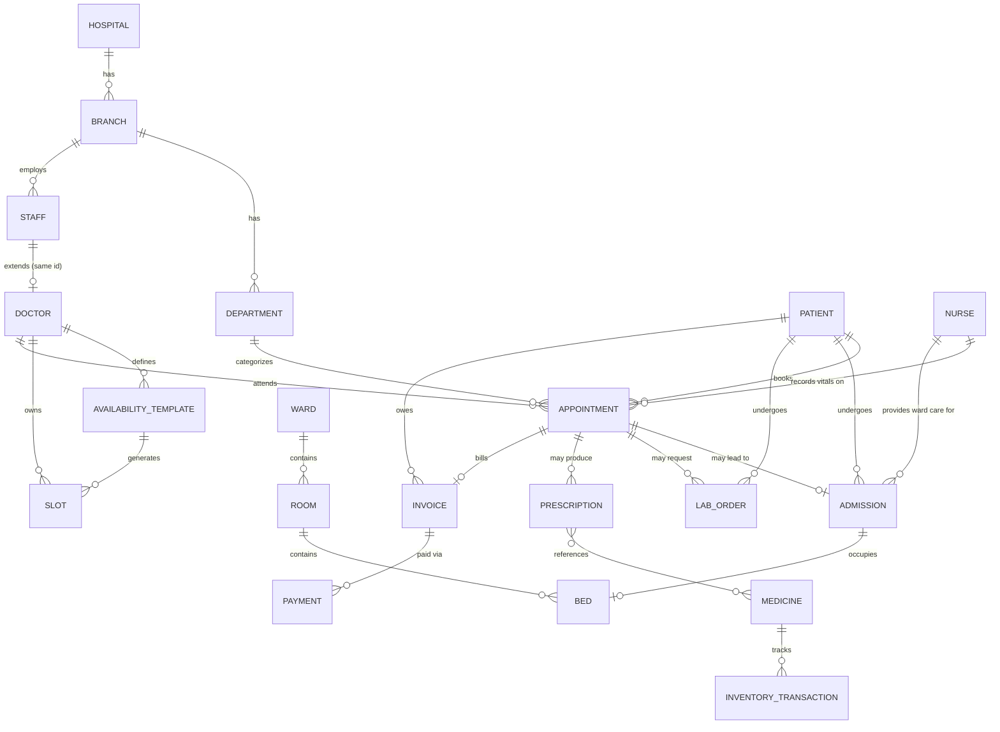
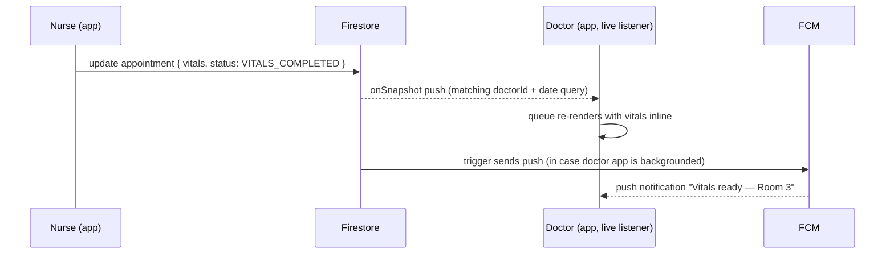
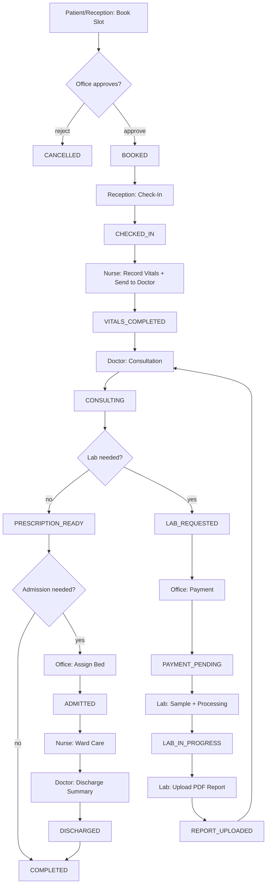

# 10 — Collection Schema

> **Revision note:** this document previously specified TypeScript interfaces for the
> earlier flat-collection design (matching what `functions/src/callable/*` actually
> implements today). It is **replaced** here with the nested-hierarchy design adopted
> in [09-firestore-design.md](./09-firestore-design.md) §9.1. See the Migration Status
> section below for exactly what does and doesn't match the current codebase.

Full per-collection field schema for the nested hierarchy. Read doc 09 first — this
one assumes its decisions (nesting rationale, mandatory fields, status families,
indexing strategy) and doesn't repeat the "why," only the "what."

## Changelog (this revision)

1. **Multi-tenancy reversed from flat to nested.** Branch-operational data now lives
   under `hospitals/{hospitalId}/branches/{branchId}/...` instead of flat top-level
   collections filtered by `hospitalId`/`branchId` fields. See doc 09 §9.1 for the
   full rationale and trade-offs.
2. **Nurse activated as a live Phase 1 role.** Vitals capture moves from Reception to
   Nurse; Nurse also does ward-care status updates during an admission. See doc 07
   and doc 08.
3. **Appointment lifecycle fully embedded.** `vitals`, check-in metadata, and the
   consultation summary are no longer separate collections (`vitals`,
   `consultations`) — they're fields on the `appointments` document itself, moving
   through an explicit status enum (§10.6). `labOrders`, `prescriptions`,
   `admissions` remain separate collections referenced by `appointmentId`.

## Migration Status — read before touching code

**Implemented.** `firestore.rules`, `firestore.indexes.json`, every callable in
`functions/src/callable/*`, and `apps/web` now all implement this nested design —
flat top-level collections, the standalone `vitals` collection, and the
append-only `consultations` collection (with its `supersedesConsultationId`
correction chain) are gone from the real codebase, not just this doc.

**Four deliberate deviations from the tree/field detail below**, made during
implementation for lower risk/complexity with no loss of tenant isolation — treat
every mention of these four points elsewhere in this document as describing the
*originally-approved* shape, not what actually ships:

1. **No separate `staff` collection.** §10.2's tree and §10.4's rationale describe a
   `.../branches/{branchId}/staff/{staffId}` collection with `doctors` as its 1:1
   extension. The real implementation has no such collection — `users/{uid}` (already
   flat, already carrying `hospitalId`/`branchId`) remains the *only* staff directory
   for every role including doctor; only the doctor-specific clinical extension nests
   under branch, directly as `.../branches/{branchId}/doctors/{uid}` (not
   `.../staff/{uid}/doctors/{uid}`). This was a scope cut, not a design reversal: a
   `staff` doc duplicating `users` fields would only pay for itself once a doctor
   practices at more than one branch, which isn't a current requirement (§10.17's
   "doctor practicing at multiple branches" note describes a *future* path via
   multiple `staff`/`doctors` docs — with no `staff` collection, that same future need
   would instead be met by multiple `doctors` docs, one per branch, still under one
   `users/{uid}`).
2. **`wards`/`rooms`/`beds` are three sibling branch-level collections**, not
   physically nested in each other as §10.2/§10.3 show. Each still carries a
   `roomId`/`wardId` reference field (as documented), matching the pre-migration
   pattern — full physical nesting would force every bed/room lookup-by-id (e.g.
   `assignBedToAdmission` receiving a bare `bedId`) to also thread ward/room ancestry
   for no additional isolation benefit.
3. **`notifications` stays entirely flat** for every recipient, staff and patient
   alike — §10.2/§10.3 show a nested staff-facing collection alongside a flat
   patient-facing one. A notification is addressed by `userId` and never queried
   cross-user, so nesting half of them added path complexity with no isolation
   benefit.
4. **`auditLogs` stays flat/platform-level**, not nested under branch as §10.2/§10.3
   show. Some audited actions (creating a hospital, assigning a hospital admin) happen
   before any branch — or even hospital — exists to nest under, and Super Admin's
   platform-wide audit view needs a flat collection to query across hospitals without
   a `collectionGroup` scan.

One correction to an earlier draft of this doc, already reflected below: `departments`
is hospital-scoped (`hospitals/{hospitalId}/departments`, sibling of `branches`), not
branch-scoped — a department spans every branch of its hospital, matching how
`doctorProfiles.departmentId` (pre-migration) and `.../doctors/{uid}.departmentId`
(now) were always used.

See root `CLAUDE.md`'s changelog for the dated summary of this migration.

---

## 10.1 Authentication, Custom Claims, and Firestore — what lives where

| Layer | Holds | Why |
|---|---|---|
| **Firebase Authentication** | email, password hash, phone (if used for OTP), provider metadata, Auth `uid` | Firebase-managed identity only — never business data, so it can be the single source of truth for "can this credential log in at all," independent of the app's own data model. |
| **Custom Claims** (on the Auth token) | `role`, `hospitalId`, `branchId` | Read on every Security Rule evaluation and every Cloud Function's `requireCallerRole`/`assertOwnHospital` check *without a Firestore read* — claims are baked into the ID token itself. This is what makes Security Rules fast (no `get()` needed to check "is this the right hospital") and is why they must be kept in sync with `users/{uid}` by a Firestore trigger (`onUserCreateSetClaims`), not set directly by client code. |
| **Firestore `users/{uid}`** | `role`, `hospitalId`, `branchId` (mirrored — the trigger's source of truth), `employeeId`, `status`, `lastLogin`, `createdAt`, `name`, `phone`, `photoUrl`, `fcmTokens` | Everything claims *can't* hold (claims have a ~1KB total size limit and aren't queryable) and everything that changes more often than a login session — display name, FCM tokens, last-login timestamp, disable/enable status. Firestore is what the app queries and displays; claims are what Rules/Functions check for authorization. |

Rule of thumb: **if a Security Rule needs to check it, it must be a claim** (not a
Firestore field — rules can't afford a `get()` per check at scale); **if the UI needs
to display or the app needs to query on it, it must be in Firestore.** `role`,
`hospitalId`, `branchId` need both, so they're deliberately duplicated and kept in
sync by `onUserCreateSetClaims` / `onUserStatusChange` (doc 13 §13.1).

---

## 10.2 Complete Firestore hierarchy

```
hospitals/{hospitalId}
├── (fields: name, registrationNumber, address, contactEmail, contactPhone,
│    logoUrl, timezone, status, createdBy, createdAt, updatedAt)
│
├── branches/{branchId}
│   ├── (fields: name, code, address, timings, contactPhone, isMainBranch,
│   │    hospitalId, status, createdBy, createdAt, updatedAt)
│   │
│   ├── departments/{departmentId}
│   ├── staff/{staffId}                          (staffId == users/{uid} id)
│   │   └── doctors/{staffId}                    (1:1 extension, same id — only if jobRole == "doctor")
│   │       ├── availabilityTemplates/{templateId}
│   │       └── slots/{slotId}                   (id: `${date}_${session}`)
│   ├── holidays/{holidayId}
│   ├── wards/{wardId}
│   │   └── rooms/{roomId}
│   │       └── beds/{bedId}
│   ├── labTestMaster/{testId}
│   ├── medicines/{medicineId}
│   │   └── inventoryTransactions/{transactionId}
│   ├── appointments/{appointmentId}              (vitals + lifecycle embedded — §10.6)
│   ├── admissions/{admissionId}
│   ├── labOrders/{labOrderId}
│   ├── prescriptions/{prescriptionId}
│   ├── invoices/{invoiceId}
│   │   └── payments/{paymentId}
│   ├── notifications/{notificationId}            (staff-facing only)
│   ├── availabilityRequests/{requestId}
│   ├── followUps/{followUpId}
│   ├── medicalCertificates/{certificateId}
│   ├── referrals/{referralId}
│   ├── feedback/{feedbackId}
│   ├── dailyStats/{date}
│   └── auditLogs/{auditLogId}
│
patients/{patientId}                              — flat, global (§9.1.2)
users/{uid}                                        — flat, global (§9.1.2)
notifications/{notificationId}                     — flat, patient-facing only (§9.1.2)
```

---

## 10.3 Collections, field by field

### `hospitals/{hospitalId}`

| Field | Type | Notes |
|---|---|---|
| `name` | string | |
| `registrationNumber` | string | statutory hospital registration id |
| `address` | map `{line1, city, state, pincode, country}` | |
| `contactEmail`, `contactPhone` | string | |
| `logoUrl` | string \| null | Cloud Storage path |
| `timezone` | string | IANA tz, used by `generateRollingSlots` (doc 13 §13.2) |
| `status` | `active` \| `disabled` | |
| `createdBy`, `createdAt`, `updatedAt` | | |

### `hospitals/{hospitalId}/branches/{branchId}`

| Field | Type | Notes |
|---|---|---|
| `name`, `code` | string | `code` is a short human label used in tokens/receipts |
| `address` | map | |
| `timings` | map `{ [weekday]: { openTime, closeTime, isClosed } }` | drives holiday/slot generation |
| `contactPhone` | string | |
| `isMainBranch` | boolean | auto-created "Main Branch" per hospital |
| `hospitalId` | string | denormalized (§9.2) |
| `status`, `createdBy`, `createdAt`, `updatedAt` | | |

### `.../branches/{branchId}/departments/{departmentId}`

| Field | Type | Notes |
|---|---|---|
| `name` | string | e.g. "Cardiology" |
| `description` | string \| null | |
| `hospitalId`, `branchId` | string | denormalized |
| `status`, `createdBy`, `createdAt`, `updatedAt` | | |

### `.../branches/{branchId}/staff/{staffId}` — unified staff record

One collection for **every** branch employee — office, reception, nurse, doctor,
pharmacy, lab — not one collection per role. See §10.4 for why.

| Field | Type | Notes |
|---|---|---|
| `uid` | string | == `staffId`, == `users/{uid}` id |
| `jobRole` | `office` \| `reception` \| `nurse` \| `doctor` \| `pharmacy` \| `lab` | mirrors `users.role` for this branch's copy |
| `departmentId` | string \| null | null for roles not department-attached (reception, pharmacy, lab) |
| `employeeId` | string | hospital-issued staff id, for badges/payroll references |
| `name`, `phone`, `photoUrl` | string | denormalized display fields, kept in sync with `users/{uid}` |
| `hospitalId`, `branchId` | string | denormalized |
| `status`, `createdBy`, `createdAt`, `updatedAt` | | |

### `.../staff/{staffId}/doctors/{staffId}` — doctor-specific extension

Only exists when the parent `staff` doc's `jobRole == "doctor"`. Same id as the
parent — a `get()` on the known `staffId`, not a query, tells you whether a staff
member has a doctor profile.

| Field | Type | Notes |
|---|---|---|
| `specialization` | string | e.g. "Cardiologist" |
| `qualifications` | string[] | e.g. `["MBBS", "MD (Cardiology)"]` |
| `consultationFee` | number | in the hospital's local currency, minor units avoided — see §10.13 on money fields |
| `departmentId` | string | duplicated from `staff` for query convenience |
| `hospitalId`, `branchId` | string | denormalized |
| `status`, `createdBy`, `createdAt`, `updatedAt` | | |

### `.../doctors/{staffId}/availabilityTemplates/{templateId}`

| Field | Type | Notes |
|---|---|---|
| `weekday` | 0–6 | |
| `startTime`, `endTime` | string `"HH:mm"` | |
| `slotDurationMinutes` | number | |
| `breakWindows` | array of `{start, end}` | |
| `walkInCapacityPerSlot`, `onlineCapacityPerSlot` | number | seeds `slots.totalCount`/`walkInReserved` at generation time |
| `hospitalId`, `branchId` | string | denormalized |
| `status`, `createdBy`, `createdAt`, `updatedAt` | | |

### `.../doctors/{staffId}/slots/{slotId}` (id: `${date}_${session}`)

| Field | Type | Notes |
|---|---|---|
| `date` | `"YYYY-MM-DD"` | |
| `session` | `morning` \| `afternoon` | |
| `totalCount` | number | total appointment capacity for the session |
| `walkInReserved` | number | portion of `totalCount` reserved for walk-ins |
| `walkInBookedCount`, `onlineBookedCount` | number | incremented transactionally on booking |
| `status` | `pendingApproval` \| `approved` \| `rejected` \| `blocked` \| `completed` | doctor must confirm before patient-visible |
| `hospitalId`, `branchId` | string | denormalized |
| `createdBy`, `createdAt`, `updatedAt` | | |

### `patients/{patientId}` — flat, global

| Field | Type | Notes |
|---|---|---|
| `userId` | string \| null | Auth uid if self-registered; null for a reception-created walk-in profile not yet claimed by a login |
| `name`, `dateOfBirth`, `gender`, `phone`, `email` | | profile core |
| `address` | map | |
| `emergencyContacts` | array of `{name, relation, phone}` | |
| `allergies` | string[] | |
| `bloodGroup` | string \| null | |
| `insurance` | map `{provider, policyNumber, documentUrl}` \| null | Phase 1: storage only, no claims workflow (doc 02 §6) |
| `hospitalRelations` | array of `{hospitalId, firstVisitAt, lastVisitAt}` | denormalized rollup — "which hospitals has this patient been seen at," refreshed on each new appointment |
| `documents` | array of `{type, url, uploadedAt}` | Storage refs |
| `status`, `createdBy`, `createdAt`, `updatedAt` | | |

The **patient timeline** is not a stored field — it's a derived, real-time view built
from `collectionGroup()` queries filtered by `patientId` across `appointments`,
`admissions`, `labOrders`, `prescriptions`, `invoices` (doc 09 §9.6), so it never goes
stale relative to the source records and never duplicates them.

### `users/{uid}` — flat, global

| Field | Type | Notes |
|---|---|---|
| `role` | `super_admin` \| `admin` \| `office` \| `reception` \| `nurse` \| `doctor` \| `pharmacy` \| `lab` \| `patient` | mirrored into custom claims |
| `hospitalId`, `branchId` | string \| null | null for `super_admin`/`patient` |
| `employeeId` | string \| null | |
| `name`, `phone`, `photoUrl`, `email` | | |
| `fcmTokens` | string[] | for push notifications |
| `status` | `active` \| `disabled` | |
| `lastLogin`, `createdAt`, `updatedAt` | Timestamp | |

### `.../branches/{branchId}/appointments/{appointmentId}` — see §10.6 for full lifecycle

| Field | Type | Notes |
|---|---|---|
| `patientId` | string | ref to `patients/{patientId}` (cross-tree ref, patients are flat) |
| `patientName` | string | denormalized for queue/list views |
| `doctorId` | string | ref to `.../doctors/{staffId}` |
| `departmentId` | string | |
| `type` | `normal` \| `emergency` | |
| `date`, `session` | | |
| `bookedVia` | `online` \| `walkin` | |
| `token` | string \| null | assigned at check-in |
| `status` | see §10.6 lifecycle enum | |
| `vitals` | map \| null | embedded — §10.6 |
| `checkIn` | map `{checkedInAt, checkedInBy}` \| null | embedded |
| `consultationSummary` | map `{diagnosis, clinicalNotes, doctorId, completedAt}` \| null | embedded — see §10.6 for the append-only trade-off this accepts |
| `waitingListPosition` | number \| null | |
| `hospitalId`, `branchId` | string | denormalized |
| `createdBy`, `createdAt`, `updatedAt` | | |

### `.../branches/{branchId}/admissions/{admissionId}`

| Field | Type | Notes |
|---|---|---|
| `appointmentId`, `patientId`, `doctorId` | string | refs |
| `bedId` | string \| null | set on assignment, not at request time |
| `nurseId` | string \| null | assigned ward-care nurse |
| `admittedAt`, `dischargedAt` | Timestamp \| null | |
| `dischargeSummary` | map `{diagnosis, treatmentGiven, conditionAtDischarge, followUpInstructions, authoredBy, authoredAt}` \| null | required before bed release (doc 02 §7) |
| `status` | `pendingBedAssignment` \| `admitted` \| `discharged` | |
| `hospitalId`, `branchId` | string | denormalized |
| `createdBy`, `createdAt`, `updatedAt` | | |

**Admission is a separate entity from appointment/consultation** because its
lifecycle (days to weeks) and cardinality (one admission can span many follow-up
appointments, ward rounds, and a discharge event) don't fit the single-visit shape of
an appointment — collapsing it into the triggering appointment would mean either a
multi-week-long appointment document (odd for a queue/schedule concept) or losing the
ability to query "all currently admitted patients" independent of any one
appointment.

### `.../branches/{branchId}/wards/{wardId}` and `.../rooms/{roomId}` and `.../beds/{bedId}`

| Collection | Key fields |
|---|---|
| `wards` | `name`, `type` (general/ICU/maternity/...), `hospitalId`, `branchId`, `status` |
| `rooms` (nested under ward) | `roomNumber`, `dailyRate`, `wardId`, `hospitalId`, `branchId`, `status` |
| `beds` (nested under room) | `bedNumber`, `status` (`available`/`occupied`/`reserved`/`cleaning`/`maintenance`), `currentAdmissionId` (string \| null), `roomId`, `hospitalId`, `branchId` |

**Beds are not embedded inside `admissions`** because a bed's lifecycle (available →
occupied → cleaning → available again) continues independent of any one admission —
querying "all available beds in Ward 3" must not require scanning admissions, and a
bed's history (which admissions it has hosted) is the inverse relationship, served by
querying `admissions.where(bedId==)`, not a field on the bed.

### `.../branches/{branchId}/labOrders/{labOrderId}`

| Field | Type | Notes |
|---|---|---|
| `appointmentId`, `patientId`, `doctorId` | string | refs |
| `tests` | array of `{testId, name, price}` | denormalized from `labTestMaster` at order time |
| `paymentStatus` | `pendingPayment` \| `paid` | office-managed gate before lab proceeds |
| `status` | `pending` \| `sampleCollected` \| `processing` \| `completed` \| `verified` \| `reportUploaded` | sequential only |
| `reportUrl` | string \| null | Cloud Storage path, set on upload |
| `reportStatus` | `pending` \| `uploaded` | |
| `hospitalId`, `branchId` | string | denormalized |
| `createdBy`, `createdAt`, `updatedAt` | | |

**Reports aren't embedded inside appointments** because a report is a large
(PDF/image) artifact with its own upload/verification lifecycle and its own
access-control shape (lab uploads, doctor + patient read, nobody edits) — bundling it
into the appointment would bloat the appointment doc with binary-adjacent metadata
that has nothing to do with scheduling/queueing, and would force every appointment
read (including list views that never need the report) to carry that weight.

### `.../branches/{branchId}/prescriptions/{prescriptionId}`

| Field | Type | Notes |
|---|---|---|
| `appointmentId`, `patientId`, `doctorId` | string | refs |
| `items` | array of `{medicineName, dosage, frequency, durationDays, instructions}` | |
| `dispenseStatus` | `pending` \| `partiallyDispensed` \| `dispensed` | updated by Pharmacy |
| `hospitalId`, `branchId` | string | denormalized |
| `createdBy`, `createdAt`, `updatedAt` | | |

**Not duplicated under `patients`** — the patient's prescription history is served by
`collectionGroup('prescriptions').where('patientId'==uid)`, so there is exactly one
writable copy of each prescription and no risk of the patient's cached copy drifting
from the source (e.g., after a dispense-status update).

### `.../branches/{branchId}/invoices/{invoiceId}` and `.../invoices/{invoiceId}/payments/{paymentId}`

| Field (`invoices`) | Type | Notes |
|---|---|---|
| `appointmentId`, `admissionId` | string \| null | |
| `patientId` | string | |
| `lineItems` | array of `{type: consultation\|lab\|pharmacy\|room, description, amount}` | generated on demand at checkout, aggregating whatever exists at that moment |
| `totalAmount`, `paidAmount` | number | |
| `status` | `unpaid` \| `partial` \| `paid` | derived from `paidAmount` vs `totalAmount` |
| `hospitalId`, `branchId` | string | denormalized |

| Field (`payments`, subcollection) | Type | Notes |
|---|---|---|
| `amount`, `method` (`cash`/`card`/`upi`), `recordedBy`, `recordedAt` | | one document per payment event |

**Invoices and payments are separate** because an invoice can be paid in more than
one installment (partial payments are explicitly supported), and because "how much is
owed" (invoice) and "what happened, when, by whom, by what method" (payment,
audit-adjacent) are different questions with different access patterns — a single
combined document would force every partial payment to be a full-document rewrite of
the invoice (including all prior payment history), instead of an append-only
subcollection write.

### `.../branches/{branchId}/medicines/{medicineId}` and `.../medicines/{medicineId}/inventoryTransactions/{transactionId}`

| Field (`medicines`) | Type | Notes |
|---|---|---|
| `name`, `unit` (tablet/ml/...), `currentStock`, `reorderThreshold`, `unitPrice` | | `currentStock` is a maintained counter, not computed by summing transactions on every read |
| `hospitalId`, `branchId` | string | |

| Field (`inventoryTransactions`, subcollection) | Type | Notes |
|---|---|---|
| `type` | `receipt` \| `dispense` \| `adjustment` \| `expiry` | |
| `quantityDelta` | number | signed |
| `referenceId` | string \| null | e.g. the `prescriptionId` for a dispense |
| `performedBy`, `performedAt` | | |

**Every inventory modification creates a transaction** — `currentStock` is updated in
the same transaction as the `inventoryTransactions` write (never independently), so
the running total and its audit trail can never diverge, and "why is stock at 42"
always has an answer.

### `.../branches/{branchId}/notifications/{notificationId}` (staff-facing) and flat `notifications/{notificationId}` (patient-facing)

| Field | Type | Notes |
|---|---|---|
| `userId` | string | recipient |
| `type` | e.g. `appointmentConfirmation`, `labReportReady`, `slotApprovalNeeded` | |
| `title`, `body` | string | |
| `read` | boolean | |
| `relatedEntityId` | string \| null | |
| `hospitalId`, `branchId` | string \| null | null for patient-facing (flat) |
| `createdAt` | | |

### `.../branches/{branchId}/auditLogs/{auditLogId}`

| Field | Type | Notes |
|---|---|---|
| `actor` | string (uid) | |
| `role` | string | |
| `action` | `create` \| `update` \| `statusChange` \| `delete` (never actually performed, but loggable) | |
| `entity` | string | collection name |
| `entityId` | string | |
| `before`, `after` | map \| null | minimal diff, not full document dumps for large docs |
| `timestamp` | Timestamp | |
| `device`, `ip` | string \| null | best-effort, from request context |
| `hospitalId`, `branchId` | string | denormalized, for `collectionGroup` platform-wide audit queries |

No `status`/`createdBy`/`updatedAt` — audit logs are immutable and have their own
shape (doc 09 §9.2 exception).

---

## 10.4 Why one unified `staff` collection (not one per role)

Doctor-specific fields (specialization, fee, qualifications) live in a **separate**
`doctors` extension document, not inline on `staff`, and role-specific behavior
(office/reception/nurse/pharmacy/lab have no equivalent extension needed today) is
handled by branching on `jobRole` in application code:

- **One collection to query for "everyone who works at this branch."** Staff
  directories, org charts, and account-management screens need exactly one query
  (`.../staff`), not a fan-out across `officeStaff`, `receptionists`, `nurses`,
  `pharmacists`, `labTechnicians` collections that would each need their own
  security rules, indexes, and list-view code.
- **Doctors need materially more structured data** (fee, specialization, templates,
  slots) than any other role — forcing that shape onto every `staff` document would
  mean every office/reception/nurse/pharmacy/lab record carries null fields for data
  that will never apply to them. A 1:1 extension document keeps the base `staff`
  shape uniform and lets `doctors` grow its own subtree (`availabilityTemplates`,
  `slots`) without polluting the parent.
- **Adding a role-specific extension later (e.g., a future `nurses` extension for
  ward-assignment preferences) is additive** — a new sibling subcollection under
  `staff/{staffId}`, not a schema migration of the base collection.

## 10.5 Departments: doctors reference `departmentId`, not physical nesting

Doctors live at `.../staff/{staffId}/doctors/{staffId}`, referencing
`departmentId` as a plain field — they are **not** nested under
`.../departments/{departmentId}/doctors/{staffId}`.

**Advantages:**
- A doctor can be reassigned to a different department by changing one field, not by
  moving a document subtree (Firestore has no move/rename for
  document-with-subcollections).
- Querying "all doctors" (for a branch directory) doesn't require iterating every
  department first — it's one `.../staff.where('jobRole','==','doctor')` (or the
  `doctors` collection group) query.
- A doctor covering more than one department (common for smaller hospitals) is a
  single `departmentId` field or, if genuinely multi-department, a
  `departmentIds: string[]` — either way trivial; nesting under one department would
  make cross-department doctors structurally awkward.

**Disadvantages:**
- "All doctors in Cardiology" requires a `where('departmentId'==id)` filter (needs an
  index) rather than being free from the path — an acceptable cost since this is a
  much less frequent query than "get this one doctor" or "all doctors at this
  branch."
- Deleting/archiving a department doesn't cascade-clean its doctors' `departmentId`
  references automatically — the service layer must handle reassignment or block
  deletion while doctors still reference it (mirrors the "no hard deletes" policy
  anyway, so this is a soft concern, not a dangling-reference risk).

---

## 10.6 Appointment lifecycle — the center of the system

Per the approved design, appointments do **not** spawn separate `checkIn`, `vitals`,
or `consultation` collections. Lifecycle state and clinical capture for the visit are
embedded directly in the appointment document, which moves through:

```
BOOKED → CHECKED_IN → VITALS_COMPLETED → CONSULTING →
  ├── (no lab needed) → PRESCRIPTION_READY → COMPLETED
  └── LAB_REQUESTED → PAYMENT_PENDING → LAB_IN_PROGRESS → REPORT_UPLOADED →
        PRESCRIPTION_READY →
          ├── COMPLETED
          └── ADMITTED → DISCHARGED → COMPLETED
```

(`CANCELLED` is reachable from `BOOKED` or `CHECKED_IN` only.)

Embedded fields, populated progressively as the appointment advances:

- `vitals: { bp, pulse, temperatureC, weightKg, heightCm, bmi, spo2, sugarMgDl, respiratoryRate, chiefComplaint, recordedBy, recordedAt, sentToDoctorAt } | null`
- `checkIn: { checkedInAt, checkedInBy, token } | null`
- `consultationSummary: { diagnosis, clinicalNotes, doctorId, completedAt } | null`

Why embed instead of separate collections:

- **One document, one real-time listener.** The doctor's queue subscribes to the
  appointment document itself; when Nurse writes vitals and flips status to
  `VITALS_COMPLETED`, the doctor's existing listener fires with the new vitals inline
  — no second listener on a `vitals` collection, no join, no race between "vitals
  document arrived" and "appointment status updated" (they're the same write).
- **The whole visit's state is one read.** Rendering the queue, the consultation
  screen, or a receipt all need "where is this visit right now" — one document get,
  not a join across `appointments` + `vitals` + `consultations`.
- **Status transitions and their data arrive atomically.** "Nurse completes vitals"
  is a single document update (`vitals` field + `status: VITALS_COMPLETED`) — there's
  no intermediate state where the vitals exist but the status hasn't caught up, or
  vice versa, which a two-collection design would have to guard against explicitly.

Trade-off accepted (flagged honestly, not glossed over): this makes the *clinical
capture* (vitals, consultation notes) part of a document whose *other* fields
(status, token) are routinely updated by non-clinical roles (Office, Reception) —
Security Rules must therefore restrict *which fields* each role may touch on the same
document (via `onlyFieldsChanged([...])` helpers, doc 12 §12.3) rather than gating
access at the collection level. It also means a corrected diagnosis is an in-place
edit to `consultationSummary`, not a new append-only document referencing the
original the way the *previous* revision of this design specified for the standalone
`consultations` collection (via `supersedesConsultationId`) — if immutable clinical
history (a legal/compliance requirement in some jurisdictions) becomes a hard
requirement, `consultationSummary` would need a `revisions: [...]` array (append
corrections, never overwrite) rather than a bare map; not built now because it wasn't
asked for, but the schema leaves room for it without a breaking change (add the array
field, keep writing the "current" summary alongside it).

### How Firestore listeners make "Send to Doctor" real-time

Nurse's "Send To Doctor" action is a single `update()` on the appointment document
(`vitals.sentToDoctorAt` + `status: 'VITALS_COMPLETED'`). The doctor's dashboard
holds a live `onSnapshot()` listener on
`.../branches/{branchId}/appointments.where('doctorId','==',uid).where('date','==',today)`
— Firestore pushes the changed document to every open listener matching that query
the moment the write commits (typically sub-second), so the doctor's queue re-renders
with the new vitals and status without polling, a page refresh, or a push
notification round-trip. FCM is used *in addition* for the case where the doctor's
tab/app isn't currently open (doc 14 covers why both are needed).

---

## 10.7 Sample documents

```jsonc
// hospitals/H001
{
  "name": "City General Hospital",
  "registrationNumber": "REG-2024-0091",
  "timezone": "Asia/Kolkata",
  "status": "active",
  "createdAt": "2026-01-10T04:00:00Z"
}

// hospitals/H001/branches/B01
{
  "name": "Main Branch",
  "code": "MB",
  "isMainBranch": true,
  "hospitalId": "H001",
  "status": "active"
}

// hospitals/H001/branches/B01/staff/U-doc-42
{
  "uid": "U-doc-42",
  "jobRole": "doctor",
  "departmentId": "D-cardio",
  "employeeId": "EMP-1042",
  "name": "Dr. A. Rao",
  "hospitalId": "H001",
  "branchId": "B01",
  "status": "active"
}

// hospitals/H001/branches/B01/staff/U-doc-42/doctors/U-doc-42
{
  "specialization": "Cardiologist",
  "qualifications": ["MBBS", "MD (Cardiology)"],
  "consultationFee": 500,
  "departmentId": "D-cardio",
  "hospitalId": "H001",
  "branchId": "B01",
  "status": "active"
}

// hospitals/H001/branches/B01/staff/U-doc-42/doctors/U-doc-42/slots/2026-07-27_morning
{
  "date": "2026-07-27",
  "session": "morning",
  "totalCount": 20,
  "walkInReserved": 5,
  "walkInBookedCount": 2,
  "onlineBookedCount": 11,
  "status": "approved",
  "hospitalId": "H001",
  "branchId": "B01"
}

// patients/P-9001   (flat, global)
{
  "userId": "P-9001",
  "name": "R. Kumar",
  "dateOfBirth": "1988-03-14",
  "bloodGroup": "O+",
  "allergies": ["Penicillin"],
  "hospitalRelations": [
    { "hospitalId": "H001", "firstVisitAt": "2025-02-01T00:00:00Z", "lastVisitAt": "2026-07-20T00:00:00Z" }
  ],
  "status": "active"
}

// hospitals/H001/branches/B01/appointments/A-7788
{
  "patientId": "P-9001",
  "patientName": "R. Kumar",
  "doctorId": "U-doc-42",
  "departmentId": "D-cardio",
  "type": "normal",
  "date": "2026-07-27",
  "session": "morning",
  "bookedVia": "online",
  "token": "014",
  "status": "VITALS_COMPLETED",
  "checkIn": { "checkedInAt": "2026-07-27T04:02:00Z", "checkedInBy": "U-recept-3", "token": "014" },
  "vitals": {
    "bp": "128/82", "pulse": 78, "temperatureC": 37.0, "weightKg": 72, "heightCm": 171,
    "bmi": 24.6, "spo2": 98, "sugarMgDl": 96, "respiratoryRate": 16,
    "chiefComplaint": "Chest tightness on exertion",
    "recordedBy": "U-nurse-9", "recordedAt": "2026-07-27T04:15:00Z", "sentToDoctorAt": "2026-07-27T04:16:00Z"
  },
  "consultationSummary": null,
  "hospitalId": "H001",
  "branchId": "B01"
}

// hospitals/H001/branches/B01/admissions/AD-330
{
  "appointmentId": "A-7788",
  "patientId": "P-9001",
  "doctorId": "U-doc-42",
  "bedId": "BED-14",
  "nurseId": "U-nurse-9",
  "admittedAt": "2026-07-27T09:00:00Z",
  "dischargedAt": null,
  "dischargeSummary": null,
  "status": "admitted",
  "hospitalId": "H001",
  "branchId": "B01"
}

// hospitals/H001/branches/B01/invoices/INV-501
{
  "appointmentId": "A-7788",
  "admissionId": "AD-330",
  "patientId": "P-9001",
  "lineItems": [
    { "type": "consultation", "description": "Consultation fee", "amount": 500 },
    { "type": "lab", "description": "Lipid Profile", "amount": 800 }
  ],
  "totalAmount": 1300,
  "paidAmount": 500,
  "status": "partial",
  "hospitalId": "H001",
  "branchId": "B01"
}

// hospitals/H001/branches/B01/auditLogs/LOG-99213
{
  "actor": "U-nurse-9",
  "role": "nurse",
  "action": "update",
  "entity": "appointments",
  "entityId": "A-7788",
  "before": { "status": "CHECKED_IN" },
  "after": { "status": "VITALS_COMPLETED" },
  "timestamp": "2026-07-27T04:16:00Z",
  "hospitalId": "H001",
  "branchId": "B01"
}
```

---

## 10.8 Firestore indexes

Two index shapes, per doc 09 §9.6:

**Branch-scoped subcollection indexes** (no `hospitalId`/`branchId` needed — the path
already scopes the query):

```json
{ "collectionGroup": "appointments", "queryScope": "COLLECTION", "fields": [
  { "fieldPath": "doctorId", "order": "ASCENDING" },
  { "fieldPath": "date", "order": "ASCENDING" },
  { "fieldPath": "status", "order": "ASCENDING" }
]}
{ "collectionGroup": "appointments", "queryScope": "COLLECTION", "fields": [
  { "fieldPath": "date", "order": "ASCENDING" },
  { "fieldPath": "status", "order": "ASCENDING" }
]}
{ "collectionGroup": "slots", "queryScope": "COLLECTION", "fields": [
  { "fieldPath": "date", "order": "ASCENDING" },
  { "fieldPath": "status", "order": "ASCENDING" }
]}
{ "collectionGroup": "labOrders", "queryScope": "COLLECTION", "fields": [
  { "fieldPath": "status", "order": "ASCENDING" },
  { "fieldPath": "createdAt", "order": "ASCENDING" }
]}
{ "collectionGroup": "beds", "queryScope": "COLLECTION", "fields": [
  { "fieldPath": "status", "order": "ASCENDING" }
]}
```

**Collection-group indexes** (`queryScope: "COLLECTION_GROUP"`, required for
cross-branch/hospital/patient-timeline reads — doc 09 §9.6):

```json
{ "collectionGroup": "appointments", "queryScope": "COLLECTION_GROUP", "fields": [
  { "fieldPath": "patientId", "order": "ASCENDING" },
  { "fieldPath": "date", "order": "DESCENDING" }
]}
{ "collectionGroup": "appointments", "queryScope": "COLLECTION_GROUP", "fields": [
  { "fieldPath": "hospitalId", "order": "ASCENDING" },
  { "fieldPath": "date", "order": "ASCENDING" },
  { "fieldPath": "status", "order": "ASCENDING" }
]}
{ "collectionGroup": "labOrders", "queryScope": "COLLECTION_GROUP", "fields": [
  { "fieldPath": "patientId", "order": "ASCENDING" },
  { "fieldPath": "createdAt", "order": "DESCENDING" }
]}
{ "collectionGroup": "prescriptions", "queryScope": "COLLECTION_GROUP", "fields": [
  { "fieldPath": "patientId", "order": "ASCENDING" },
  { "fieldPath": "createdAt", "order": "DESCENDING" }
]}
{ "collectionGroup": "admissions", "queryScope": "COLLECTION_GROUP", "fields": [
  { "fieldPath": "patientId", "order": "ASCENDING" },
  { "fieldPath": "createdAt", "order": "DESCENDING" }
]}
{ "collectionGroup": "invoices", "queryScope": "COLLECTION_GROUP", "fields": [
  { "fieldPath": "patientId", "order": "ASCENDING" },
  { "fieldPath": "createdAt", "order": "DESCENDING" }
]}
{ "collectionGroup": "auditLogs", "queryScope": "COLLECTION_GROUP", "fields": [
  { "fieldPath": "hospitalId", "order": "ASCENDING" },
  { "fieldPath": "createdAt", "order": "DESCENDING" }
]}
```

Firestore auto-suggests the exact missing index (with a ready-to-paste JSON snippet
and console link) whenever a query without one runs in the emulator or in staging —
this list is representative of the shapes needed, not the final exhaustive set, which
should be captured module-by-module as each query is implemented.

---

## 10.9 Security Rules strategy

Full design and helper functions: [12-security-rules.md](./12-security-rules.md)
(updated for the nested path model). Summary:

- Tenant scope comes from **path segments** (`hospitalId`, `branchId` bound in the
  `match` block), compared against the caller's custom claims — not from
  `resource.data` fields, which strengthens isolation (doc 09 §9.1) since a path
  segment can't be spoofed by a malformed document the way a data field theoretically
  could be.
- `patients` and `users` keep flat-collection rules (ownership/self scope — no path
  segments to bind).
- Every collection's `list`/`get` still requires the caller to be within an
  authorized scope for that path — an authenticated user with the right role but the
  wrong `hospitalId`/`branchId` claim is rejected before Firestore even evaluates
  `resource.data`, because the path itself won't match their claim.
- No hard deletes anywhere (`allow delete: if false` except the same narrow
  `holidays` exception carried over from the original design).

```
// Example: nested rule shape for a role-restricted field-level write (Nurse vitals)
match /hospitals/{hospitalId}/branches/{branchId}/appointments/{appointmentId} {
  allow update: if (hasRole(['nurse']) && isBranchScoped(hospitalId, branchId)
      && resource.data.status == 'CHECKED_IN'
      && request.resource.data.status == 'VITALS_COMPLETED'
      && request.resource.data.diff(resource.data).affectedKeys().hasOnly(['vitals', 'status', 'updatedAt']));
}
```

## 10.10 Role permission matrix

Authoritative matrix: [08-permission-matrix.md](./08-permission-matrix.md) (updated
with the Nurse column and the Vitals-row ownership change in this revision). Not
duplicated here to avoid the two documents drifting — doc 08 is single-source, per its
own stated policy.

---

## 10.11 Mermaid ER Diagram



## 10.12 Mermaid Sequence Diagram — Vitals real-time hand-off (Nurse → Doctor)



## 10.13 Mermaid Flowchart — Full patient visit lifecycle



---

## 10.14 Architecture explanation (summary)

The system is one Firestore database per environment (not per hospital), tenant
boundaries enforced structurally by nesting operational collections under
`hospitals/{h}/branches/{b}`, with patient identity and platform-wide auth kept flat
because they are, by design, not tenant-bound. Every write funnels through a Cloud
Function (never a direct client write for anything beyond a few narrow
self-service field updates — doc 12 §12.1), which is both the authorization
checkpoint and the audit-log writer, so Security Rules exist as the *backstop*
against a bypassed or buggy client, not as the primary authorization mechanism.
Real-time UX (doctor queues, nurse hand-offs) comes from Firestore's native
`onSnapshot()` listeners on narrowly-scoped, indexed queries — never from polling —
with FCM layered on top only for the case where no listener is currently open.

## 10.15 Optimization recommendations

- **Read cost**: every list view queries a branch subtree or a `collectionGroup` with
  an equality filter as the first clause (never an unfiltered collection scan);
  dashboard counts come from maintained `dailyStats` documents, not `count()` queries
  over large collections re-run on every page load, and definitely not
  client-side-counted query results.
- **Write cost**: multi-document business actions (booking, consultation, bed
  assignment) are single transactions, so partial failures never leave inconsistent
  state that would need a compensating read-repair.
- **Document size**: `appointments` is the one document that accumulates fields over
  its lifecycle (vitals + check-in + consultation summary) — still comfortably under
  Firestore's 1MiB limit even with generous string fields, but if free-text clinical
  notes ever grow unusually large (e.g., pasted lab narrative text), move that
  specific field to Cloud Storage with a reference, rather than let one pathological
  document threaten the 1MiB ceiling for the whole collection's write path.
- **Denormalization**: kept intentionally minimal and one-directional — display
  fields cached onto the "many" side (e.g., `patientName` onto `appointments`), never
  the reverse, so there's exactly one place each fact is refreshed from.

## 10.16 Future scalability considerations

- **Sharding hot counters**: `slots.onlineBookedCount`/`walkInBookedCount` use
  `FieldValue.increment()`, which Firestore can sustain up to roughly 1 write/second
  sustained per document before contention — fine at single-doctor-session scale
  (dozens of bookings across a session, not per second), but if a specific
  high-demand doctor/hospital ever approaches that ceiling, the standard Firestore
  "distributed counter shard" pattern (splitting the counter across N subdocuments)
  is a drop-in fix that doesn't change the schema shape above it.
- **Collection-group query cost at platform scale**: Super Admin's platform-wide
  rollups (doc 09 §9.6) scale with total matching documents, not total hospitals — as
  the platform grows, these should move toward reading pre-aggregated `dailyStats`
  (already the pattern for per-branch dashboards) rather than ever running an
  unbounded `collectionGroup` scan for a live "all appointments ever" view.
- **Multi-region**: Firestore's native multi-region configuration (already the
  right default for a healthcare SaaS) means no schema change is needed to add
  hospitals in a new geography — only the appropriate multi-region database
  location choice made once at project setup.
- **A doctor practicing at multiple branches/hospitals**: already representable
  today (doc 09 §9.1) as multiple `staff`/`doctors` documents under one `users/{uid}`
  — no future schema change needed, only UI to let such a doctor switch branch
  context.

## 10.17 Common pitfalls and how to avoid them

- **Forgetting `collectionGroup` indexes.** A cross-branch query silently fails at
  runtime (not at deploy time) if its collection-group index is missing — always
  exercise every patient-timeline/Admin-rollup query against the emulator before
  shipping the feature that introduces it.
- **Trusting denormalized `hospitalId`/`branchId` fields for security.** They exist
  for query convenience only (doc 09 §9.2) — Security Rules must always re-derive
  tenant scope from path segments, never from `resource.data.hospitalId`, or a
  document with a spoofed/incorrect field becomes a tenant-isolation bypass.
- **Embedding without a size/mutation-frequency budget.** Vitals/check-in/consultation
  are embedded in `appointments` deliberately (§10.6) precisely because they're
  bounded in size and mutated by a small, known set of steps — embedding an
  unbounded or high-frequency-write list (e.g., a chat thread, a live vitals stream)
  into a document that many other roles also read/write would create write
  contention and blow past the 1MiB ceiling; those belong in their own collection.
- **Skipping the doctor-approval gate "just this once."** The nightly slot-generation
  and manual one-off slots both still require doctor confirmation before becoming
  patient-visible — bypassing it for an urgent same-day slot (via a direct Firestore
  write, say) breaks the one invariant patients are relying on ("if I can see it, the
  doctor has actually agreed to it").
- **Treating `staff`/`doctors` as a global identity.** They are branch-scoped
  extension documents (doc 09 §9.1) — code that assumes "one doctor record per
  person" platform-wide will break the moment a doctor practices at a second branch;
  always resolve "which doctor record" via `(uid, branchId)`, not `uid` alone,
  outside of `users/{uid}` itself.
